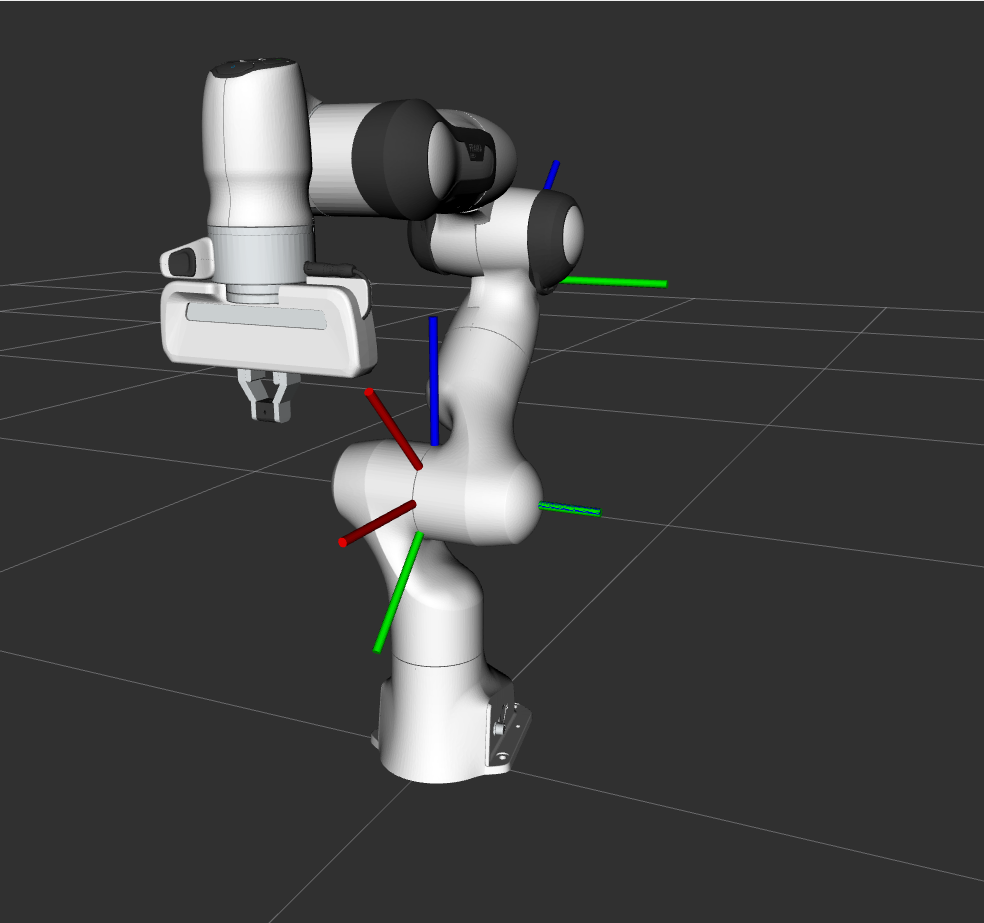

# dualq_kinematics

This repository is a ROS2 C++ package aiming to become a MoveIt2 kinematics plugin using "**dual quaternions**". In Robotics, the Denavit-Hartenberg convention and homogeneous transformation matrices are commonly used to solve forward and inverse kinematics. 

However, modern approaches use the **product of exponential** and dual quaternions can be used in this context as they can represent homogeneous transformation and screw displacements. [Wikipedia link on Screw Axis](https://en.wikipedia.org/wiki/Screw_axis)

This second approach requires fewer arithmetic operations and is therefore faster. For example, this is particularly usefull when forward kinematics is used in an optimization problem needing a huge number of forward kinematics computations to converge. Also dual quaternions are more compact than a transformation matrix. Computations of the forward kinematics of the Franka Emika robot (7DOF) are **under the microsecond**.

The package is based on ROS2 Humble. In this repository, the dual quaternions is built using Eigen library, to ensure compatbility with MoveIt and others. It means that the dual quaternion class has 2 `Eigen::Quaternion` as members and that the constructors take Eigen types as inputs. The `DualQuaternion` and `ScrewCoordinates` classes are templates to follow Eigen's logic. 

---

## Dual quaternions

A dual quaternion is composed of two quaternions, one is called the real part and the other the dual part. The dual quaternion is the extension of quaternions to dual numbers.

### **Forward Kinematics**

Generally, the product of exponential states that

$$`T_{Tip}^0  = ({\Pi}_{0}^n \  e^{({\xi_n} * {\theta}_{n})}) * T_{Tip}^0 (0)`$$

where $`{\xi_n}`$ is a **twist** and $`\underline{\theta}`$ is a vector of joint angles and  $`T_{Tip}^0(0)`$ is **tip2Base** transform when the manipulator is at rest

**Twist**: *"A twist can be represented as a normalized screw axis, a representation of the direction of the motion, multiplied by a scalar speed along the screw axis"* (Northwestern University)

**Screw axis** are characterized by the axis expressed in a frame and a position of a point on it, they can represent the joints of a robot. In this method, the screw axes information are used rather than the Denavit-Hartenberg parameters, no intermediate coordinate systems are needed

When using dual quaternions in this context, it is needed to:
- Define screw axes [1]
- Apply motion to them using the **dual angle** [1]
- Use the product of exponentials

Let's keep in mind that dual quaternions multiplication and exponential are defined in [1] and [2]

### **Inverse Kinematics** 

Inverse kinematics can be computed by dividing the forward kinematics equation into so-called Paden-Kahan sub-problems: [Wikipedia](https://en.wikipedia.org/wiki/Paden%E2%80%93Kahan_subproblems). 

Recent work by [6] "**IKGeo**" shows that any analytically solvable robot can be decomposed into geometrical subproblems (not using dual quaternions). [5] shows good examples on how to use Paden Kahan subproblems to solve IK but highlights that many robot structures can't be solved by out of the box Paden Kahans. [8] presents generalization of paden kahan subproblems to solve a widely used 6DOF structure. [7] GeoFIK shows excellent work on Franka robot using geometry insight, screw coordinates and the exponential map.

This package shows how to solve IK for the **Franka Emika Panda robot** by combining the 3 original Paden-Kahan subproblems and using quaternions and dual quaternions.

Using PoE with Paden Kahan is convenient as Paden-Kahan subproblems can be expressed with exponentials in SO(3). Starting with Poe for Franka robot:

<p align="center">

$`T_{Tip}^0  = e^{({\xi_1} * {\theta}_{1})} * e^{({\xi_2} * {\theta}_{2})} *  * e^{({\xi_3} * {\theta}_{3})} *  e^{({\xi_4} * {\theta}_{4})} *  * e^{({\xi_5} * {\theta}_{5})} * e^{({\xi_6} * {\theta}_{6})} * e^{({\xi_7} * {\theta}_{7})} *  T_{Tip}^0 (0)`$


Let's remind that **q7 is given a value** (fixed). Then we **revert the kinematic chain** as Franka robot has a **spherical joint at the shoulder** and not at the wrist:

<p align="center">

</p>

*Spherical Shoulder at the intersection of 3 screw*

Let's rewrite $`e^{({\xi_n} * {\theta}_{n})}`$ by $`e^{n}`$

$`Inverse (T_{Tip}^0 * T_{0}^{Tip} (0) * e^{-7})  = e^{-6} * e^{-5} * e^{-4} *e^{-3} * e^{-2} * e^{-1}`$

Let's rewrite $`Inverse (T_{Tip}^0 * T_{0}^{Tip} (0) * e^{-7})`$ by $`g`$ which is a transformation expressed as a dual quaternion and $`g \otimes p`$ means point $`p`$ transformed by $`g`$

**$` g \otimes p  = e^{-6} * e^{-5} * e^{-4} *e^{-3} * e^{-2} * e^{-1} \otimes p`$** where $`p`$ is the spherical shoulder simplifies to:

**$` g \otimes p  = e^{-6} * e^{-5} * e^{-4} \otimes p`$** enables 

**$`|| g \otimes p - g \otimes w ||   = || e^{-4} \otimes p - w ||`$** 
where $`w`$ is the wrist, the intersection of joint 5 and 6. This is Paden Kahan Subrproblem 3. On the left hand side, both point have to be expressend in the same reference frame to form a distance. Once q4 is found: $`e^{({\xi_4} * {\theta}_{4})} = g(q_{4})`$ can be computed and used as a transformation

**$` g \otimes p  = e^{-6} * e^{-5} * g(-q_{4}) \otimes p`$** 
can be written and solved as a second Paden Kahan subproblem, after which q6 and q5 are known

**$`g  = g(-q_{6}) * g(-q_{5}) * g(-q_{4}) *e^{-3} * e^{-2} * e^{-1}`$**

**$`g(q_{6}) * g(q_{5}) * g(q_{4}) * q = e^{-3} * e^{-2} * e^{-1} \otimes r ` $** 
can be written where $`r`$ is a point on the first screw axis only and is a Second Paden Kahan subproblem and then a point not on the first screw can be chosen to solve a first Paden Kahan subproblem

</p>


---

## Status of the project

This repository has:
- ✅ A library enabling construction and operations on dual quaternions
- ✅ The capability of getting screw coordinates out of a MoveIt robot (defined by an URDF)
- ✅ Compute forward kinematics (through the use of dual quaternion exponential and multiplication)
- ✅ Adding Paden-Kahan subproblems handling (for inverse kinematics)
- ✅ Adding Inverse Kinematics solution for 6DOF (q7 is fixed)

The following is currently under development:
- Adding Singularity avoidance
- Adding redundancy resolution to handle 7DOF
- Make the plugin out of the package

--- 

## Prerequesites

- Install ROS2 Humble
- Install MoveIt2

---

## Getting Started

```bash
source /opt/ros/humble/setup.bash
git clone https://github.com/thomasphilip6/dualq_kinematics.git
cd dualq_kinematics
colcon build 
source install/setup.bash
``` 

The demo can then be launched:

```bash
ros2 launch dualq_kinematics dualq_kinematics_demo.launch.py
``` 

And in the output, you can see the forward kinematics being computed correctly:
```bash
[dualq_kinematics_demo-1] [INFO] [1765644724.015255894] [dualq_kinematics_demo]: MoveIt FK Returned : 
[dualq_kinematics_demo-1] [INFO] [1765644724.015273387] [dualq_kinematics_demo]: Translation: 
[dualq_kinematics_demo-1]  0.358409
[dualq_kinematics_demo-1] -0.773386
[dualq_kinematics_demo-1]  0.407073
[dualq_kinematics_demo-1] 
[dualq_kinematics_demo-1] [INFO] [1765644724.015294978] [dualq_kinematics_demo]: Rotation: 
[dualq_kinematics_demo-1] -0.582924 -0.554271  0.594124
[dualq_kinematics_demo-1] -0.782642  0.186534 -0.593866
[dualq_kinematics_demo-1]  0.218338 -0.811165 -0.542531
[dualq_kinematics_demo-1] 
[dualq_kinematics_demo-1] [INFO] [1765644724.015379736] [dualq_kinematics_demo]: Translation: 
[dualq_kinematics_demo-1]  0.358409
[dualq_kinematics_demo-1] -0.773386
[dualq_kinematics_demo-1]  0.407073
[dualq_kinematics_demo-1] 
[dualq_kinematics_demo-1] [INFO] [1765644724.015400816] [dualq_kinematics_demo]: Rotation: 
[dualq_kinematics_demo-1] -0.582924 -0.554271  0.594124
[dualq_kinematics_demo-1] -0.782642  0.186534 -0.593866
[dualq_kinematics_demo-1]  0.218338 -0.811165 -0.542531
[dualq_kinematics_demo-1] 
[dualq_kinematics_demo-1] [INFO] [1765644724.015412398] [dualq_kinematics_demo]: Dual Quaternions FK and MoveIt FK match: 1
```

Make sure to compile in release mode to get the fastest computation times `--cmake-args -DCMAKE_BUILD_TYPE=Release` 
```bash
[dualq_kinematics_demo]: Dual Quaternions FK took (over 1000 tries) 0.607738 us.
```

---

## Testing 

To run DualQuaternion class unit tests:

```bash
./build/dualq_kinematics_DualQuaternionTest
```

To run ScrewCoordinates class integration (a MoveIt Robot is passed) tests:

```bash
launch_test test/launch/ScrewCoordinates.test.py
```
---

## Debugging


Build the code in debug mode and follow ros2 humble documentation on the topic:

```bash
colcon build --packages-up-to <package_name> --cmake-args -DCMAKE_BUILD_TYPE=Debug
```

To debug ScrewCoordinates, uncomment the commented line in `ScrewCoordinates.test.py`:

```python
screw_coordinates_node =  launch_ros.actions.Node(
            package="dualq_kinematics",
            executable="dualq_kinematics_ScrewCoordinatesTest",
            #Uncomment following line to debug with gdb
            #prefix=['gdb -ex run --args'],
            parameters=[
                moveit_config,
                test_param,
            ],
            output="screen",
)
``` 
---

### References

- [1] Dual Quaternions by Yan-Bin Jia
- [2] Practical Exponential Coordinates using Implicit Dual Quaternions by Neil T. Dantam
- [3] Robust and efficient forward, differential, and inverse kinematics using dual quaternions by Neil T. Dantam
- [4] Analytical Solution for Inverse Kinematics Using Dual Quaternions by Ping-Feng Lin, Ming-Bao Huang, and Han-Pang Huang, Member, IEEE
- [5] EE106A Discussion 4: Inverse Kinematics {jaymonga16, amaysaxena, isabella.huang, valmik}@berkeley.edu
- [6] IK-Geo: Unified Robot Inverse Kinematics Using Subproblem Decomposition, Alexander J. Elias, Graduate Student Member, IEEE, and John T. Wen, Fellow, IEEE
- [7] GEOFIK: A FAST AND RELIABLE GEOMETRIC SOLVER FOR THE IK OF THE FRANKA ARM BASED ON SCREW THEORY ENABLING MULTIPLE REDUNDANCY PARAMETERS Pablo C. Lopez-Custodio, Yuhe Gong, and Luis F.C. Figueredo
- [8] Algorithmic approach to geometric solution of generalized Paden–Kahan subproblem and its extension Igor Dimovski, Mirjana Trompeska, Samoil Samak,Vladimir Dukovski 2 and Dijana Cvetkoska 


---